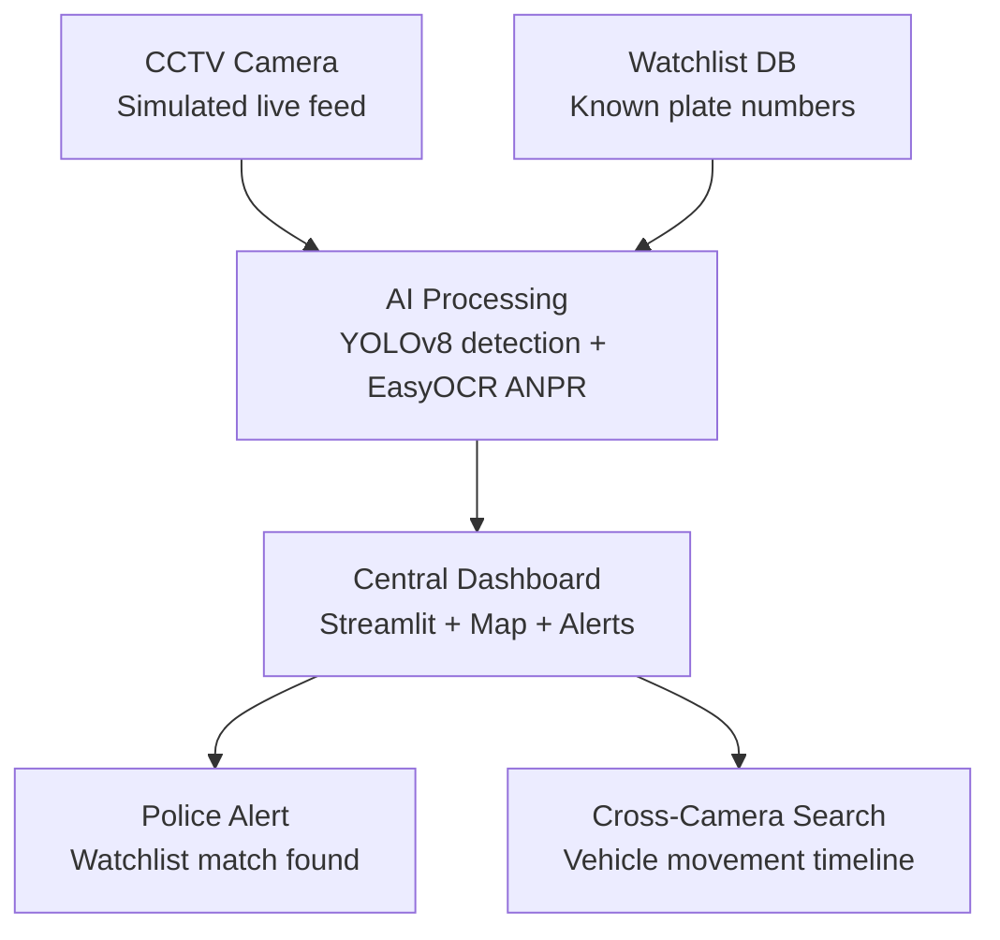

# System Architecture — Gujarat Smart CCTV AI Prototype



## Kaise padhein

1. **CCTV Camera** — abhi recorded video file "live feed" ki tarah treat hota hai. Production mein ye RTSP/live stream ban jayega — code ka baaki hissa nahi badlega.
2. **AI Processing** — har frame pe YOLOv8 se vehicle/person detect hota hai; vehicle mile to EasyOCR se plate padhi jati hai.
3. **Watchlist DB** — abhi ek CSV file hai (`watchlist.csv`); production mein Government database se connect hoga — architecture same rahega.
4. **Central Dashboard** — Streamlit app jo stats, alerts, detection log, aur camera map dikhata hai.
5. **Police Alert** — jab detected plate watchlist se match kare.
6. **Cross-Camera Search** — jab same plate 2+ cameras pe dikhe, uska time-order timeline banta hai (`track.py`).

## Scale kaise hoga

```
1 camera (prototype)  →  10-50 cameras (pilot)  →  1,000+ cameras  →  80,000+ cameras (Gujarat-wide)
```

Architecture wahi rehta hai — sirf camera feeds ki sankhya badhti hai. Har camera independently `detect.py` chalata hai (ya containerized microservice ban jata hai), aur sab ek hi central `detections_log.csv` / database mein likhte hain, jisse dashboard sab cameras ka combined view deta hai. Isi tarah horizontal scaling kaam karta hai — naya camera add karne ke liye poora system redesign nahi karna padta.
